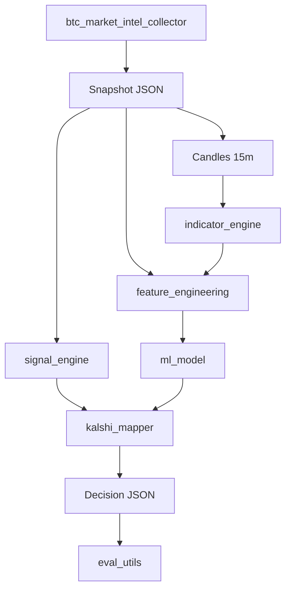

# Bitcoin Data Collector

A decision-grade pipeline for Bitcoin market intelligence and Kalshi-style probability forecasts. The system collects multi-source BTC data, produces explainable rule-based signals, engineers ML features (including liquidity sweeps and IFVG indicators), trains calibrated classifiers, and runs a live loop that fuses rule + ML outputs into conservative trade recommendations.

**This project generates recommendations only — it does not execute trades.**

## What it does

1. **Collect** — Pull price, liquidity, derivatives, on-chain, sentiment, and macro data from public APIs with graceful degradation.
2. **Signal (rules)** — Deterministic scoring and 24h up/down/range probabilities from the snapshot schema.
3. **Features + ML** — Build numeric features from 15m candles + snapshot fields; train interpretable models with time-series validation and calibration.
4. **Fuse + map** — Combine rule and ML probabilities; compare to a manual market-implied probability to compute edge and BUY YES / BUY NO / NO TRADE.
5. **Evaluate** — Log predictions live, backfill realized outcomes, and monitor rolling accuracy and calibration drift.

## Architecture



## Requirements

- Python 3.11+
- See `requirements.txt` for core dependencies (`pandas`, `numpy<2`, `scikit-learn`, etc.)
- `httpx`, `python-dotenv` (included in `requirements.txt`)

```bash
python -m venv .venv
source .venv/bin/activate   # Windows: .venv\Scripts\activate
pip install -r requirements.txt
```

Optional: set `COINGECKO_API_KEY` in a `.env` file for higher CoinGecko rate limits.

## Quick start

### 1. Collect a snapshot

```bash
python btc_market_intel_collector.py --output-dir outputs
```

Writes timestamped JSON (and optional CSV) under `outputs/`. Each snapshot includes `market_data.candles_15m` for reproducible feature engineering.

### 2. Run the rule-based signal engine

```bash
python signal_engine.py outputs/btc_market_intel_<timestamp>.json --pretty
```

Or use the example runner:

```bash
python examples/run_signal_engine.py outputs/btc_market_intel_<timestamp>.json
```

### 3. Backtest rule probabilities (needs history)

Point-in-time snapshots in `outputs/` can be backtested once you have enough files spaced across your horizon:

```bash
python backtester.py outputs --horizon-hours 24 --plot-dir backtest_plots
```

For the small bundled sample set, use a shorter horizon:

```bash
python examples/run_backtest.py --input outputs --horizon-hours 1
```

### 4. Train an ML model

Build a labeled dataset from a directory of snapshots (or CSV), train with time-series CV, calibrate on a holdout tail, and save artifacts under `models/`:

```bash
python ml_model.py outputs --model-family logreg --horizon-hours 24
```

Model families: `logreg` (default), `decision_tree`, `hgb`.

### 5. Run the live loop

Runs the collector, fuses rule + latest saved model, and appends to `live_outputs/predictions_log.jsonl`. Pass a manual market-implied probability to enable edge-based recommendations:

```bash
python live_runner.py --once --market-implied-prob 0.52
```

Continuous mode (default interval: 15 minutes):

```bash
python live_runner.py --interval-seconds 900 --market-implied-prob 0.52
```

If no model exists or candles are missing, the runner degrades to rule-only and logs warnings.

### 6. Scan live Kalshi BTC markets (recommendation only)

Fetches open BTC-related Kalshi contracts, compares fused model probabilities to market-implied mids, and ranks opportunities. **Does not place trades.**

```bash
# Full scan: collect snapshot + Kalshi markets + rank
python examples/run_kalshi_scan.py

# Use an existing snapshot (faster)
python examples/run_kalshi_scan.py --snapshot outputs/btc_market_intel_<timestamp>.json

# Skip collector
python examples/run_kalshi_scan.py --no-collect --snapshot outputs/btc_market_intel_<timestamp>.json
```

Output: `live_outputs/kalshi_scans/scan_<UTC>.json` plus a summary table (ticker, edge, recommendation).

### 7. Hourly BTC event scanner (recommendation only)

Level-3 automation for Kalshi **hourly BTC threshold** contracts such as `"BTC price today at 3 PM EDT"` or `"Bitcoin above $78,000 at 4 PM EDT"`. The scanner:

1. Fetches active `KXBTCD` hourly markets
2. Parses target time, strike, and direction
3. Selects the best model horizon (15m / 30m / 60m / 4h / 24h) from time remaining
4. Estimates fair-value YES/NO probability using strike-distance CDF + rule + ML + orderbook fusion
5. Compares model probability to Kalshi market mid
6. Outputs conservative **BUY YES**, **BUY NO**, or **NO TRADE** recommendations

**Does not execute trades or connect to order placement.**

```bash
# Full hourly scan (collect snapshot + scan + rank)
python hourly_event_scanner.py --event-filter "BTC price today" --conservative

# Or via examples wrapper
python examples/run_hourly_event_scan.py --conservative --once

# Use existing snapshot
python hourly_event_scanner.py --no-collect --snapshot outputs/btc_market_intel_<timestamp>.json
```

Optional flags: `--min-edge 0.10`, `--min-confidence 0.65`, `--max-spread 0.08`, `--min-liquidity-score 0.50`, `--output-dir hourly_outputs`.

Output: `hourly_outputs/scan_<UTC>.json` and `.csv` with ranked `buy_yes`, `buy_no`, and `no_trade` buckets.

#### How YES/NO edge is calculated

- `yes_edge = model_yes_probability - market_yes_probability`
- `no_edge = model_no_probability - market_no_probability`
- **BUY YES** when `yes_edge > 10%` and confidence > 65% (and liquidity/spread guards pass)
- **BUY NO** when `no_edge > 10%` and confidence > 65%
- Otherwise **NO TRADE** (default)

Strike probability uses a transparent lognormal approximation: scale annualized volatility to the selected horizon, apply directional drift from the rule engine composite score, then compute `P(price > strike)` via the normal CDF. Results are blended with rule (20%), ML (30%), strike-distance (40%), and orderbook quality (10%) — weights are configurable in `hourly_probability_model.FusionWeights`.

#### Why NO TRADE is the default

The hourly scanner is intentionally conservative. Recommendations are suppressed when edge or confidence is insufficient, the bid-ask spread is too wide, liquidity is poor, contract parsing is uncertain, or too little time remains before settlement. This reduces false positives from model/market mismatch or thin markets.

#### Example JSON output (truncated)

```json
{
  "timestamp": "2026-05-27T14:30:00+00:00",
  "btc_price": 76448.91,
  "ranked": {
    "buy_yes": [{
      "contract_ticker": "KXBTCD-26MAY2717-T77000.99",
      "contract_title": "Bitcoin above $77,000 at 5 PM EDT",
      "target_time_edt": "2026-05-27 05:00 PM EDT",
      "time_to_expiry_minutes": 42,
      "strike_price": 77000,
      "selected_horizon": "60m",
      "market_yes_probability": 0.37,
      "model_yes_probability": 0.51,
      "yes_edge": 0.14,
      "confidence": 0.72,
      "recommendation": "BUY YES",
      "key_drivers": [
        "Model YES probability is 14 percentage points above market YES price.",
        "Liquidity is acceptable and spread is within threshold."
      ],
      "warnings": []
    }],
    "buy_no": [],
    "no_trade": []
  }
}
```

**Disclaimer:** This tool produces research and decision-support signals only. It is not financial advice and does not place trades on Kalshi or any exchange.

For general multi-contract scanning (all `KXBTC`/`KXBTCD` markets, 12h/24h proxies), use `examples/run_kalshi_scan.py` instead.

#### Kalshi credentials (optional)

Public market data works without credentials. For future authenticated endpoints, set in `.env`:

| Variable | Description |
|----------|-------------|
| `KALSHI_API_BASE` | API base URL (default: `https://api.elections.kalshi.com/trade-api/v2`) |
| `KALSHI_API_KEY_ID` | API key ID (optional) |
| `KALSHI_PRIVATE_KEY_PATH` | Path to RSA private key PEM (optional) |
| `KALSHI_BTC_SERIES_TICKER` | Optional single series filter; default scans `KXBTC` and `KXBTCD` |

If credentials are missing, the client logs once and continues with public `GET /markets`.

#### Edge and NO TRADE (general Kalshi scan)

**Edge** = `model_probability - market_implied_probability` (YES mid from bid/ask). Positive edge means the model sees a higher chance than the market; negative edge favors **BUY NO**.

**NO TRADE** is the conservative default when:

- Market implied probability is missing
- \|edge\| is below the minimum (default **3%**)
- Model confidence is below **0.55**
- Contract title parsing is uncertain (`unknown` type or low mapping confidence)
- Liquidity is poor (wide spread or low liquidity score)
- Rule and ML models disagree materially

This matches the guardrails in `kalshi_mapper.py`. Rankings are research signals only — not execution instructions.

### 8. Evaluate live performance

After outcomes are backfilled (automatic in the live loop once the 24h horizon passes):

```bash
python eval_utils.py --predictions-log live_outputs/predictions_log.jsonl --outcomes-log live_outputs/outcomes_log.jsonl
```

Reports rolling accuracy, Brier score, log loss, calibration gaps, and `retrain_recommended` when drift thresholds are exceeded.

### 9. Build labeled dataset on Verdant_AI

Export ML training labels and a full decision dataset (rule + ML fusion, edge, recommendations) to the external volume. Requires enough snapshot history for your horizon (e.g. 24h labels need files spanning at least one day).

**Layout on the volume:**

```
/Volumes/Verdant_AI/btc_kalshi/
  datasets/
    labeled_features_{UTC}.csv
    decision_dataset_{UTC}.csv
    dataset_manifest_{UTC}.json
  market_probs/
    market_probs.csv    # your sidecar (one row per snapshot timestamp)
```

**Steps:**

1. Collect snapshots into `outputs/` (or copy `live_outputs/snapshots/`).
2. Train a model: `python ml_model.py outputs --horizon-hours 24`
3. Copy `examples/market_probs.template.csv` to `/Volumes/Verdant_AI/btc_kalshi/market_probs/market_probs.csv` and add a `market_implied_prob` (0–1) per snapshot timestamp.
4. Export:

```bash
python dataset_builder.py outputs \
  --output-dir /Volumes/Verdant_AI/btc_kalshi/datasets \
  --market-probs-csv /Volumes/Verdant_AI/btc_kalshi/market_probs/market_probs.csv \
  --horizon-hours 24
```

**Sidecar CSV** (required columns: `timestamp`, `market_implied_prob`; optional: `contract_hint`, `notes`). Timestamps are matched with nearest-neighbor join within 5 minutes (configurable via `--market-match-tolerance-minutes`). Rows without a sidecar match get `edge` null and **NO TRADE**.

**Decision CSV columns** include `rule_p_*`, `ml_p_*`, `fused_p_*`, `market_implied_prob`, `edge`, `recommendation` (`BUY YES` / `BUY NO` / `NO TRADE`), and realized `y_true` for evaluation.

Use `--labeled-only` or `--decision-only` for partial exports. For a short bundled sample, use `--horizon-hours 1`.

**Label vs rule band:** ML labels use ±1% (`TrainConfig.range_threshold_pct`); rule range probabilities use ±0.5% (`SignalEngineConfig.range_band_pct`). The manifest JSON records both.

## Project layout

| Module | Role |
|--------|------|
| `btc_market_intel_collector.py` | Multi-source data collection and unified snapshot schema |
| `signal_engine.py` | Explainable rule engine → score, direction, 24h probabilities |
| `indicator_engine.py` | Liquidity sweeps + IFVG features on 15m candles |
| `feature_engineering.py` | ML feature row from snapshot + candles + indicators |
| `ml_model.py` | Dataset build, train/calibrate, persist, explain, importance |
| `kalshi_mapper.py` | Fuse rule/ML probs → edge and recommendation |
| `kalshi_client.py` | Kalshi API fetch + normalized market objects |
| `contract_mapper.py` | Parse BTC contract titles → model probability keys |
| `strategy_ranker.py` | Rank multi-contract opportunities vs market implied prob |
| `event_target_parser.py` | Parse hourly BTC event titles → strike, time, direction |
| `kalshi_orderbook_features.py` | Kalshi orderbook normalization, liquidity, guardrails |
| `hourly_probability_model.py` | Multi-horizon strike CDF + rule/ML/orderbook fusion |
| `hourly_fair_value_engine.py` | YES/NO edge, conservative BUY YES/NO/NO TRADE logic |
| `hourly_event_scanner.py` | Hourly event scan orchestrator + CLI (recommendation only) |
| `decision_utils.py` | Shared rule-probability extraction and confidence helper |
| `dataset_builder.py` | Batch labeled/decision CSV export to Verdant_AI |
| `live_runner.py` | Live loop, degraded mode, prediction/outcome logs |
| `eval_utils.py` | Rolling metrics and retrain warnings from live logs |
| `backtester.py` | Historical evaluation of rule-engine probabilities |
| `metrics.py` | Shared accuracy, Brier, log loss, calibration helpers |

## Snapshot schema (high level)

Snapshots are JSON objects with stable keys, including:

- `price_data`, `volume_data`, `liquidity_data`, `derivatives_data`
- `on_chain_data`, `sentiment_data`, `macro_data`
- `market_data.candles_15m` — list of `{timestamp, open, high, low, close, volume}`
- `source_health` — per-source status for confidence haircuts
- `signals` — derived boolean flags (volume spike, low liquidity, etc.)

## Kalshi decision output

When `market_implied_prob` is provided, `kalshi_mapper` returns objects like:

```json
{
  "contract": "up",
  "probability": 0.58,
  "market_implied_prob": 0.52,
  "edge": 0.06,
  "confidence": 0.61,
  "recommendation": "BUY YES",
  "key_factors": ["..."],
  "ml_explanation": ["ret_log_24h (+0.12)", "..."],
  "warnings": []
}
```

Without market implied probability, `edge` is `null` and recommendation is **NO TRADE** (conservative default).

## Data sources

Public APIs with fallbacks where noted:

- **Spot / candles / order book** — Binance (primary), Coinbase (fallback)
- **Aggregates** — CoinGecko
- **Derivatives** — Binance Futures (OI, funding, liquidations)
- **On-chain** — Blockchain.com charts
- **Sentiment** — Alternative.me Fear & Greed
- **Macro correlations** — CoinGecko BTC series + FRED (SPX, gold, NASDAQ)

Some fields are intentionally `null` with TODO notes (ETF flows, exchange flows, options IV) until paid feeds are integrated.

## Configuration

Behavior is controlled via dataclasses in each module (e.g. `SignalEngineConfig`, `FeatureConfig`, `TrainConfig`, `FusionConfig`, `LiveConfig`). Adjust weights, horizons, edge thresholds, and indicator parameters in code or by extending CLI flags.

Default fusion weights: **55% rule / 45% ML**. Minimum edge: **3%**, minimum confidence: **0.55**.

## Limitations

- Snapshots are point-in-time; backtests and ML training need enough historical files for your chosen horizon.
- Binance endpoints may be blocked in some environments; Coinbase fallbacks apply.
- Live runner invokes the collector as a subprocess; ensure the working directory is the repo root.
- `live_runner.py` still accepts a manual `--market-implied-prob`; use `examples/run_kalshi_scan.py` for live multi-contract Kalshi scanning.
- Kalshi contract strikes may not match rule-engine ±0.5% bands or ML ±1% labels; the ranker emits warnings when semantics diverge.

## License

Add your license here.
